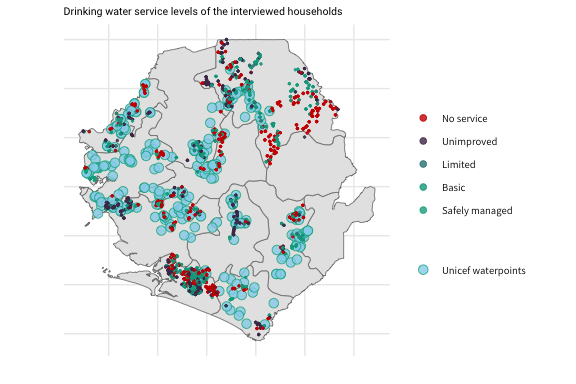
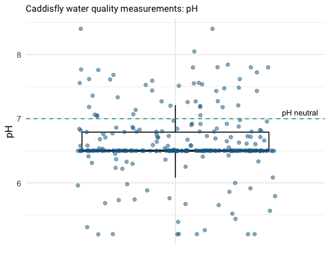

## Background
The world faces an invisible crisis of water quality. Its impacts are wider, deeper, and more uncertain than previously thought and requires urgent attention. 

## Goals 
The objective of water quality monitoring is to obtain quantitative information on the physical, chemical, and biological characteristics of the water. Specifically in this case:

## Sample and Population Characteristics

For the sample 1100 communities that live near the UNICEF wells were selected. These communities are spread over 45 chiefdoms as can be seen in the table below.

|        |Regions |Districts |Chiefdoms |Counties |Communities |Households |
|:-------|:-------|:---------|:---------|:--------|:-----------|:----------|
|Sample  |5       |11        |45        |         |1100        |2427       |
|Country |5       |16        |190       |1316     |            |7076119    |

The figure below shows the spread of the households surveyed compared to the location of the UNICEF wells. There is quite some visual overlap in the location apart from the west area of the ditrict Bonthe and the north, east and south areas of Koinadugu. Because the districts ..... was chosen to survey households further from the wells. 

<!-- -->

## Water Quantity

To get an indication of the quality of the drinking water sources used, water sources are often categorised. The table below shows the categories used by the JMP. The JMP uses the type of water source to form the categories: piped water into dwelling, plot or yard, other improved sources and unimproved sources. 
  

|Status                            |Water.sources                                                                                                                                   |
|:---------------------------------|:-----------------------------------------------------------------------------------------------------------------------------------------------|
|Unimproved                        |Unprotected dug well, unprotected spring, cart with small tank/drum, surface water (river, dam, lake, pond, stream, canal, irrigation channels) |
|Other improved                    |Public taps or standpipes, tube wells or boreholes, protected dus wells, protected springs or rainwater collection                              |
|Piped into dwelling, plot or yard |Piped household water connection located inside the user's dwelling, plot or yard                                                               |
  
The classification of the water source is used to indicate the service level of the water source. The table below again shows the service levels of water sources as indicated by the JMP. Next to the classification of the water sources they use the distance of the water source to the household to indicate a service level. 

  

|Service.level  |Definition                                                                                                                               |
|:--------------|:----------------------------------------------------------------------------------------------------------------------------------------|
|Safely managed |Drinking water from an improved source which is located on premises, available when needed and free of faecal and priority contamination |
|Basic          |Drinking water from an improved source provided collection time is not more than 30 minutes for a roundtrip, including queuing           |
|Limited        |Drinking water from an improved source provided collection time exceeds 30 minutes for a roundtrip, including queuing                    |
|Unimproved     |Drinking water from an unprotected dug well or unprotected spring                                                                        |
|No service     |Drinking water collected directly from a river, dam, lake, pond, stream or irrigation channel                                            |
  
  
The plot below shows the percentage of households that report having safely managed, basic, limited, unimproved drinking water services or no drinking water service. The largest part of the households has basic drinking water services, namely 35%. However, an almost equal part of the households reports having unimproved drinking water service and about 25% reports having no drinking water service.
  
<!-- -->
    
When plotting the same data on a map, one can observe the spread of the drinking water service levels over the country. What is noticable is that especially in the south of Koinadugu there seem to be a lot of household without drinking water services. This coincides with location of the UNICEF wells, whos presence is less in that area.

<!-- -->

##### Drinking water level of the households per district

|District      | Nr of Unicef waterpoints| Safely managed| Basic| Limited| Unimproved| No service|
|:-------------|------------------------:|--------------:|-----:|-------:|----------:|----------:|
|Bo            |                       17|           7.27| 32.73|    6.36|      50.00|       3.64|
|Bombali       |                       27|           7.84| 40.20|    9.80|      11.76|      30.39|
|Bonthe        |                       12|           3.30| 37.34|    2.40|      22.82|      34.13|
|Kailahun      |                        -|           5.44| 34.01|    3.40|      27.21|      29.93|
|Kenema        |                       39|          23.12| 38.12|    1.88|       8.75|      28.12|
|Koinadugu     |                       26|           4.81| 34.79|    1.75|      26.26|      32.39|
|Kono          |                        -|          25.00|  0.00|    0.00|       0.00|      75.00|
|Moyamba       |                       34|           1.33| 31.33|    2.67|      29.33|      35.33|
|Pujehun       |                       18|           6.76| 31.08|    0.00|      36.49|      25.68|
|Tonkolili     |                       28|          15.11| 17.27|    2.88|      16.55|      48.20|
|Western Rural |                        -|           0.00| 18.64|    0.00|      76.27|       5.08|

## Sanitation

|Service.level   |Definition                                                                                                                                             |
|:---------------|:------------------------------------------------------------------------------------------------------------------------------------------------------|
|Safely managed  |Use of improved facilities which are not shared with other household and where excreta are safely disposed in situ or transported and treated off-site |
|Basic           |Use of improved facilites which are not shared with other households                                                                                   |
|Limited         |Use of improved facilites which are shared between two or more households                                                                              |
|Unimproved      |Use of pit latrines without a slab or platform, hanging latrines or bucket latrines                                                                    |
|Open Defecation |Disposal of human faeces in fields, forests, bushes, open bodies of water, beaches and other open spaces or with solid waste                           |

<!-- -->

## Hygiene

<!-- -->

## Water Quality

<!-- -->

<!-- -->

### Caddisfly

### Risk assessment score

## UNICEF wells

<!-- -->

|Parameter               |WHO Guideline for drinking water                 | Waterpoints min (mg/l)| Waterpoints mean (mg/l)| Waterpoints max (mg/l)|
|:-----------------------|:------------------------------------------------|----------------------:|-----------------------:|----------------------:|
|ammonia                 |1,5 mg/l (odour) / 35 mg/l (taste)               |                   0.02|               0.0860289|                   1.00|
|chloride                |-                                                |                   0.50|               5.7340909|                  20.00|
|electrical conductivity |1500 us/cm                                       |                   0.00|             109.1816955|                1226.00|
|fluoride                |1,5 mg/l                                         |                   0.05|               0.1956967|                   2.00|
|iron                    |-                                                |                   0.02|               0.1230000|                   1.00|
|nitrate                 |50 mg/l                                          |                   1.00|               3.0605042|                  30.00|
|nitrite                 |3 mg/l                                           |                   0.01|               0.0142143|                   0.50|
|ph                      |No health-based guideline                        |                   5.20|               6.6129749|                   8.40|
|phosphate               |No drinking water threshold indicated by the WHO |                   0.05|               0.1282671|                   2.05|
|potassium               |No drinking water threshold indicated by the WHO |                   0.60|               2.5317857|                  16.00|

<!-- -->

<!-- -->

