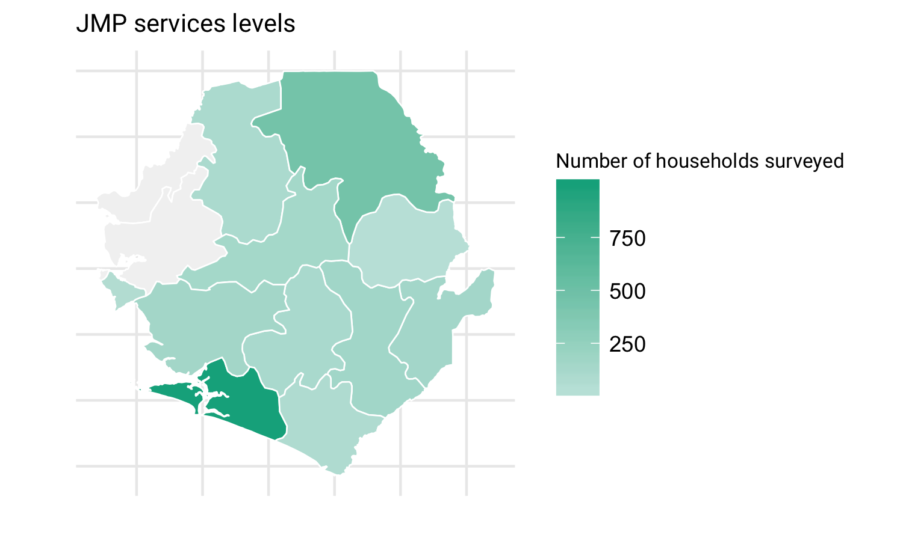

## Background
The world faces an invisible crisis of water quality. Its impacts are wider, deeper, and more uncertain than previously thought and requires urgent attention. 


## Goals 
The objective of water quality monitoring is to obtain quantitative information on the physical, chemical, and biological characteristics of the water. Specifically in this case:

## Sample and Population Characteristics


```r
knitr::kable(location, caption = "JMP service levels", format="latex")
```

\begin{table}[t]

\caption{\label{tab:results}JMP service levels}
\centering
\begin{tabular}{l|r|r}
\hline
variable & Sample & Country\\
\hline
Region & 5 & 5\\
\hline
District & 11 & 16\\
\hline
Chiefdom & 45 & 190\\
\hline
Household & 2427 & 7076119\\
\hline
\end{tabular}
\end{table}

#### Map
<!-- -->

## Water Quantity

<!-- -->

<!-- -->


## Sanitation

## Hygiene

## Water Quality

### Caddisfly

### Risk assessment score


